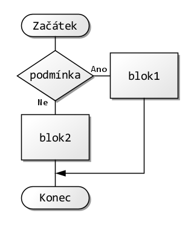
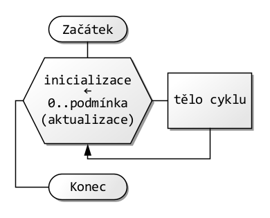
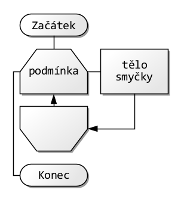
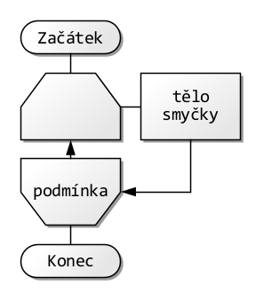

# Řídicí struktury v Javě

## Podmíněné větvení

### `if / else if / else`

#### Sytax a pravidla



```java
if (podmínka1) {
    // blok 1
} else {
    // blok 2
}
```

* **Vyhodnocení:** výraz v závorce musí být `boolean`. Nelze implicitní převod z čísla/objektu.
* **Rozsah (scope):** proměnné deklarované uvnitř bloku `{}` žijí jen tam.
* **Definite assignment:** proměnná přiřazená jen v jedné větvi může být mimo blok považovaná za nepřiřazen;ou — řeš úplným pokrytím nebo inicializací.

```java
int score = ...;
String grade;
if (score >= 90) {
    grade = "A";
} else {
    grade = "B";
}
```

> **Pozor:** řetězení podmínek piš od nejužší k nejširší; jinak některé větve nikdy nenastanou (nedorazitelný kód).

#### if jako výraz (JDK 13+)

* Pomocí **textových bloků** můžeš `if` použít jako výraz vracející hodnotu.

```java
String status = (score >= 90) ? "A"
               : (score >= 80) ? "B"
               : (score >= 70) ? "C"
               : "F";
```

### Ternární operátor `?:`

* **Precedence:** má nižší prioritu než `+`, `*`, `&&`, `||` atd. — občas je lepší přidat závorky pro čitelnost.
* **Typ výsledku:** kompilátor se snaží najít společný typ obou větví (numeric promotion, boxing).

```java
double discount = vip ? 0.15 : (total > 1000 ? 0.10 : 0.0);
```

**Antipattern:** vnořené ternary přes 2 úrovně zhoršuje čitelnost → raději `if`.

## `switch` – klasický a moderní (expression)

### Klasický `switch` (statement)

#### Sytax a pravidla


```java
switch (výraz) {
    case konstanta1:
        // blok 1
        break;
    case konstanta2:
        // blok 2
        break;
    default:
        // výchozí blok
}
```

* **Podporované typy:** `byte/short/int/char`, jejich boxované verze, `String` (od JDK 7), `enum`.
* **Fall-through:** bez `break` spadne do další větve.

```java
switch (code) {
    case 200:
        log("OK");
        break;
    case 201:
    case 204:
        log("OK – no content"); // sdílená větev
        break;
    default:
        log("Other");
}
```

> **Pozor:** `null` vyhodí `NullPointerException`.

### Moderní `switch` expression (JDK 14+, náhled od 12)

* **Šipky `->`** místo `:`; **žádný implicitní fall-through**.
* **Vrací hodnotu** (expression) nebo může být statement.
* **`yield`** jen pokud používáš bloku `{}` s více příkazy.
* **Kompatibilní typy** jako klasický + v nových JDK pattern matching/guardy.

```java
String label = switch (status) {
    case 200, 201 -> "ok";
    case 400 -> "bad";
    default -> {
        var s = "other:" + status;
        yield s; // nutné v bloku
    }
};
```

> **Null-safety:** `switch (x)` s `x == null` stále hází NPE → ošetři `case null -> ...` jen v náhledových pattern-matching verzích (JDK 21 má „preview“ pro **switch with patterns**).

### Pattern matching v `switch` (JDK 21 – **preview**)

* **`case Type t`** a **guardy** `when`. Užitečné s sealed hierarchiemi.

```java
String show(Object o) {
    return switch (o) {
        case Integer i when i > 0 -> "pos int " + i;
        case Integer i -> "int " + i;
        case String s  -> "str " + s.toUpperCase();
        case null      -> "null";
        default        -> "other";
    };
}
```

> **Tip:** Se sealed třídami může kompilátor vynutit úplnost výčtu.

## Smyčky

### `for` (počítaná)

#### Sytax a pravidla



```java
for (inicializace; podmínka; aktualizace) {
    // tělo smyčky
}
```

* Tři části: inicializace; podmínka; aktualizace. Každá je volitelná.
* Můžeš deklarovat více proměnných stejného typu.

```java
for (int i = 0, j = n - 1; i < j; i++, j--) {
    swap(a, i, j);
}
```

**Reachability:** kód za `for(;;){}` bez `break` je nedosažitelný.

### „Enhanced for“ (for-each)

* Iteruje přes **pole** a **`Iterable`** (kolekce). Není k dispozici index.
* **Nelze** přímo odebírat prvky kolekce → použij `Iterator.remove()`.

```java
for (String s : list) {
    System.out.println(s);
}
```

**ConcurrentModificationException:** vzniká při strukturální změně kolekce během iterace for-each; pokud potřebuješ mazat, jdi přes iterátor:

```java
for (Iterator<String> it = list.iterator(); it.hasNext(); ) {
    if (shouldRemove(it.next())) it.remove();
}
```

## Přeskoky

### `break` a `continue`

* `break` končí **nejbližší** smyčku nebo `switch`.
* `continue` skáče na **další iteraci** smyčky (u `for` provede nejdřív část „update“).

```java
for (int i = 0; i < 10; i++) {
    if (i % 2 == 0) continue; // přeskoč sudá
    if (i == 7) break;        // skonči ve 7
    process(i);
}
```

### Označené (labeled) `break`/`continue`

* Cílem může být libovolný **označený** blok nebo smyčka nadřazené úrovně.
* Používej střídmě — zhoršuje čitelnost; často jde nahradit metodou.

```java
outer:
for (int r = 0; r < R; r++) {
    for (int c = 0; c < C; c++) {
        if (found(r, c)) break outer;
    }
}
```

### `while` a `do … while`

#### `while`

##### Sytax a pravidla



```java
while (podmínka) {
    // tělo smyčky
}
```

#### `do … while`

##### Sytax a pravidla



```java
do {
    // tělo smyčky
} while (podmínka);
```

* `while` testuje **před** tělem, `do … while` **po** těle (proběhne min. jednou).
* Riziko nekonečné smyčky → jistota, že se **mění stav** vedoucí k ukončení.

```java
int n = 10;
while (n-- > 0) { /* ... */ }

int choice;
do { choice = read(); } while (choice < 1 || choice > 3);
```

## Pokročilé řízení toku

### Výjimky (řízení toku při chybách)

### `try / catch / finally`

* `finally` běží **vždy** (i při `return`, `break`, `continue`), kromě hrubých havárií JVM.
* **Multi-catch** (JDK 7+): `catch (IOException | SQLException e)`.
* **Precise rethrow:** pokud po `catch` výjimku jen přehazuješ, typ se může zúžit.

```java
try {
    risky();
} catch (IOException | UncheckedIOException e) {
    log(e);
} finally {
    cleanup();
}
```

### `throw`

* Vyhazuje instanci `Throwable`. **Checked** výjimky musí být deklarované v signatuře metody `throws`, nebo zachycené.

```java
void setAge(int age) {
    if (age < 0) throw new IllegalArgumentException("age < 0");
}
```

### Try-with-resources (JDK 7+; rozšíření v JDK 9+)

* Uzavírá zdroje (`AutoCloseable`) deterministicky v opačném pořadí.
* **Suppressed exceptions:** pokud v `close()` také padne výjimka, přidá se do `getSuppressed()`.

```java
try (BufferedReader br = Files.newBufferedReader(path)) {
    return br.readLine();
}
```

**JDK 9+:** můžeš použít proměnnou deklarovanou dříve, pokud je „efektivně final“:

```java
BufferedReader br = Files.newBufferedReader(path);
try (br) { ... }
```

## `assert`

* Aktivuje se parametrem běhu **`-ea`**. Bez něj se těla `assert` přeskočí.
* Používej pro **interní invariants** v testovacích/lab režimech, **ne** jako uživatelskou validaci.

```java
assert speed >= 0 : "negative speed";
```

> **Pozor:** vedlejší efekty uvnitř `assert` se mimo `-ea` neprovedou.

## Logické a bitové operátory

### Krátké vyhodnocování `&&` a `||`

* Pravá strana se vyhodnocuje jen když je to nutné (lazy).
* Bezpečný idiom proti NPE:

```java
if (obj != null && obj.isReady()) { ... }
```

### Bitové `&`, `|`, `^` a logické negace

* U `boolean` existují **i ne-zkrácené** varianty `&` a `|` (vyhodnotí obě strany).
* Posuny: `<<`, `>>` aritmetický, `>>>` logický (doplní nuly).

```java
int flags = READ | WRITE;
boolean both = (flags & (READ | WRITE)) == (READ | WRITE);
```

## Bloky, rozsahy, definitivní přiřazení

* **Lokální blok** pro omezení rozsahu:

```java
{
    var tmp = compute();
    use(tmp);
}
// tady už tmp neexistuje
```

* **Definite assignment**: kompilátor hlídá, že proměnná je před čtením přiřazená. Platí i pro `switch` expression: každá větev, která může nastat, musí vrátit hodnotu.

## Moderní idiomy a srovnání se Streams

* **Jednoduché transformace/filtrace**: Streams často zkracují kód a vyhnou se mutable stavům.

```java
List<String> upper = list.stream()
    .filter(s -> s.length() > 3)
    .map(String::toUpperCase)
    .toList(); // JDK 16+
```

* **Kdy zůstat u smyčky:** když potřebuješ index, časnou „escape“ (`break`), nebo výkonově kritické sekce s minimem alokací.

## Časté chyby & best practices (rychlý checklist)

* ❌ `==` pro řetězce/objekty → ✅ `equals()` / `Objects.equals(a,b)`.
* ❌ Porovnání `double` na rovnost → ✅ tolerance `Math.abs(a-b) < EPS`.
* ❌ Zapomenutý `break` v klasickém `switch` → ✅ moderní `switch` expression.
* ❌ Mutace kolekce během for-each → ✅ iterátor s `remove()`.
* ❌ Logika v `finally` měnící návratovou hodnotu → ✅ vyhni se „return v finally“.
* ✅ Pro zdroje používej try-with-resources.
* ✅ Krátké podmínky piš ternárním operátorem, ale maximálně do jedné úrovně.
* ✅ U `switch` nad `enum` zvaž, zda **nechceš** pokrýt všechny hodnoty a vynechat `default` (pak tě kompilátor upozorní, až enum rozšíříš).
