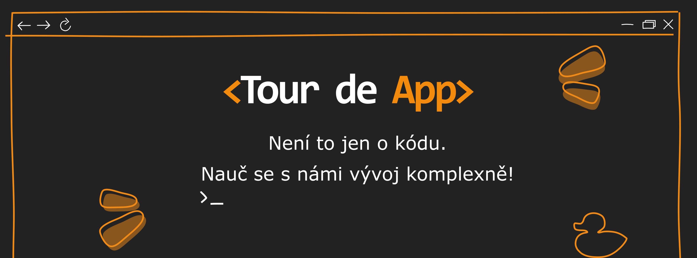
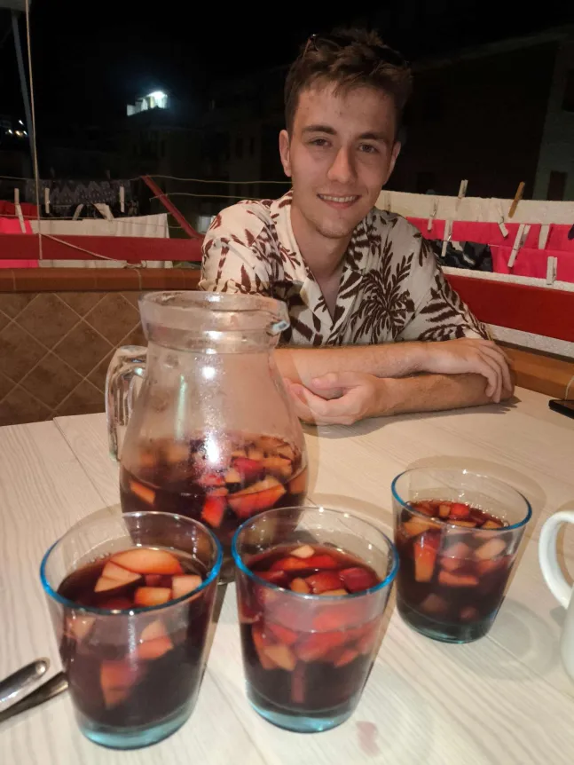
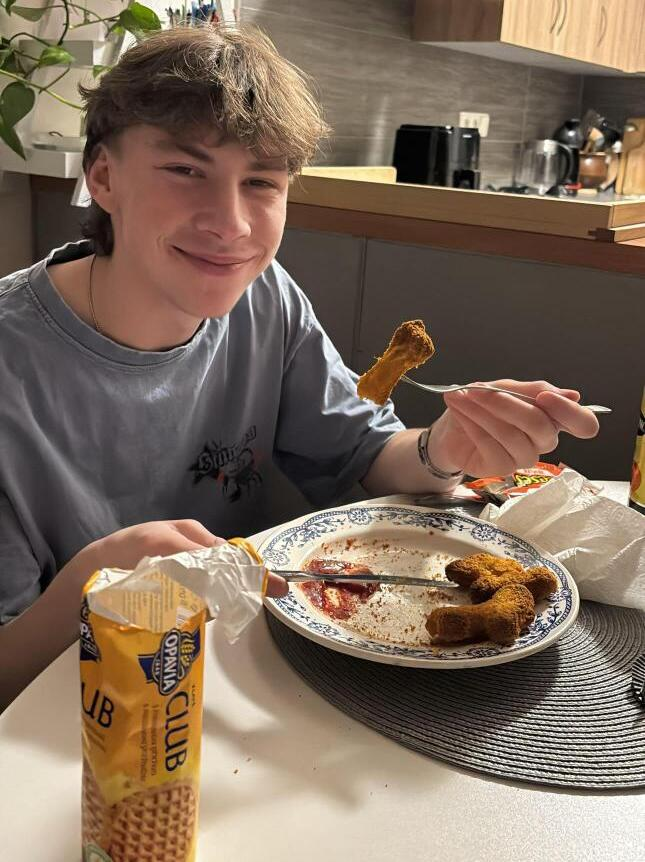
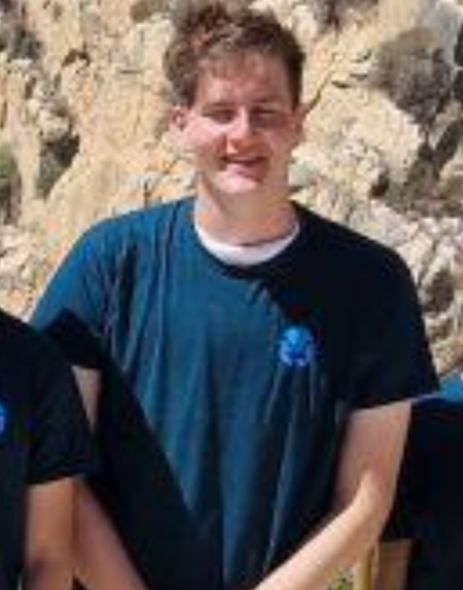

# Bobr Layer
Ahoj, my jsme tým Bobr Layer z Pardubic, přesněji ze Střední průmyslové školy Elektrotechnické a Vyšší odborné školy Pardubice. Jsme tým skládájící se ze 2 čtvrťáků a jednoho třeťáka. A proč ten název? Protože máme jednoho učitele, jehož přezdívka je prohození prvních písmen jména a příjmení (Bibor Lajer). Jenže to bylo moc okatý, tak jsme to ještě trochu schovali 🤫.

Richard Hývl|       Petr Machovec       |Nicolas Weiser
:-------------------------:|:-------------------------:|:-------------------------:
|  | 
Back-endový Mág 🧙‍♂️️🗄️|   Front-end Boss️ 👑🖥️   |Majitel Designu 🎨🧑‍🎨
Dancer 💃🕺|   Milovník rapu     🎤    |Beat Saber master 🗡️
Milovník šachu ♞|  Malej, ale šikovnej 😈   |Apple maniac 🍐

## 🚀 Technologie

- **Backend:** Spring Boot 3.3.5 (Java 21)
- **Frontend:** Thymeleaf + React
- **Databáze:** PostgreSQL 16
- **Deployment:** Docker + Tour de Cloud
- **Reverse Proxy:** Caddy

## 📋 Požadavky

- Java 21+
- Maven 3.9+
- Docker & Docker Compose
- PostgreSQL 16 (nebo Docker)

## 🛠️ Lokální spuštění

### 1. Spusťte PostgreSQL
``
docker compose up --build
``
### 2. Přístup k aplikaci

- **Aplikace:** http://localhost
- **API:** http://localhost/api

### Přihlašovací údaje

- **Username:** lecturer
- **Password:** TdA26!

## 📁 Struktura projektu

src/main/java/cz/projektantpata/tda26/  
├── caddy/ # Konfigurace Caddy (reverzní proxy)  
├── db/ # Databáze (PostgreSQL) 
├── frontend/ # Zdrojový kód frontendu (React)  
├── readme-img/ # Obrázky pro README.md 
├── src/ # Zdrojový kód backendu (SpringBoot) 
└── README.md # Read me soubor 