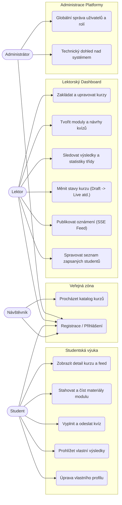
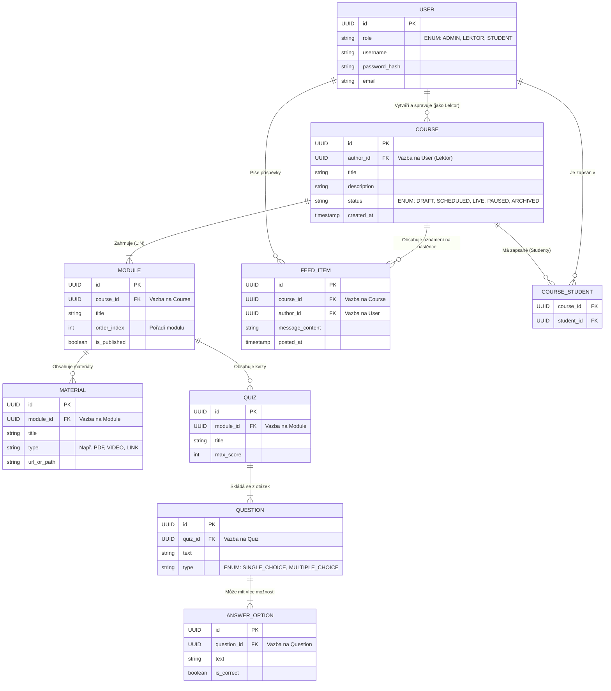

Úvod 

Hlavním účelem této webové aplikace je návrh a realizace moderní vzdělávací platformy pro fiktivní partnerskou společnost Teachers Digital Academy. Cílem projektu je integrace kurzů, kvízů a interaktivních výukových prvků do jednoho přehledného prostředí, čímž dochází k inovaci tradičních metod online výuky. Aplikace je navržena tak, aby efektivně sloužila lektorům při tvorbě kurzů, správě studijních podkladů a sledování studijních výsledků. Současně se platforma orientuje na studenty, kterým nabízí atraktivnější formu vzdělávání prostřednictvím interaktivních cvičení a okamžité zpětné vazby, což představuje kvalitativní posun oproti pasivnímu studiu statických materiálů. 

Klíčovým technickým prvkem řešení je implementace informačního kanálu využívajícího technologii Server-Sent Events (SSE). Tato technologie zajišťuje real-time komunikaci mezi serverem a klientem, díky čemuž jsou uživatelé okamžitě informováni o novém obsahu či změnách bez nutnosti manuálního obnovování stránky. 

Téma maturitní práce bylo zvoleno v návaznosti na účast v soutěži Tour de App 2026, kterou pořádá organizace Think Different Academy. Tato soutěž mě oslovila svým ambiciózním záměrem vyhledávat mladé talenty a podněcovat vznik projektů, které dosahují kvalit reálných softwarových produktů. Zadání soutěže, strukturované do šesti fází od základního návrhu architektury až po plně funkční aplikaci, mi poskytlo ideální metodický rámec pro vypracování komplexní dokumentace i samotného softwarového díla. 

Významnou motivací pro mě byla nejen příležitost k prohloubení odborných znalostí a posunu technických dovedností na vyšší úroveň, ale také soulad mého přístupu k vývoji s vizí organizátorů, kteří kladou důraz na kreativitu a modernizaci vzdělávání. Neméně důležitým faktorem byla snaha důstojně reprezentovat svou školu v celostátní soutěži a vytvořit sofistikovaný projekt, který se stane hodnotnou součástí mého osobního profesního portfolia. 

 Analýza obdobných webových stránek 

Provedení analýzy existujících řešení je nezbytným krokem před zahájením vlastního vývoje. Tento průzkum nám umožňuje pochopit zavedené standardy v oblasti e-learningu a identifikovat očekávání uživatelů ohledně ovládání a funkcionality. Důležitým aspektem je také inspirace v oblasti UI/UX designu a odhalení nedostatků konkurenčních platforem. Díky tomu se můžeme vyvarovat designových chyb a navrhnout aplikaci, která bude uživatelsky přívětivější a nabídne přidanou hodnotu, kterou konkurence postrádá (např. v našem případě real-time interakce pomocí SSE). 

    Udemy 

Adresa: https://www.udemy.com/ 

Udemy je jednou z největších globálních vzdělávacích platforem, která funguje na principu online tržiště. Umožňuje nezávislým lektorům a odborníkům vytvářet vlastní kurzy, nahrávat videa, studijní materiály a kvízy. Studenti si mohou tyto kurzy zakoupit (nebo se zapsat do bezplatných) a studovat vlastním tempem. Platforma nabízí širokou škálu kategorií od programování přes byznys až po osobní rozvoj a poskytuje nástroje pro komunikaci mezi lektorem a studentem. 

    Kladné stránky 

    Obrovská variabilita obsahu: Díky otevřenosti platformy je zde dostupný kurz téměř na jakékoli téma. 

    Robustní systém hodnocení: Uživatelé mohou kurzy hodnotit hvězdičkami a psát recenze, což pomáhá novým studentům v orientaci a motivuje lektory ke kvalitě. 

    Uživatelsky přívětivý přehrávač: Rozhraní pro přehrávání kurzů je intuitivní, umožňuje měnit rychlost přehrávání, vkládat záložky a automaticky ukládá postup. 

    Sekce Q&A: U každého kurzu existuje prostor pro otázky a odpovědi, kde mohou lektoři reagovat na nejasnosti studentů. 

 

    Záporné stránky 

    Nejednotná kvalita kurzů: Jelikož kurz může vytvořit kdokoliv, kvalita výuky, zvuku a obrazu značně kolísá a není centrálně garantována. 

    Nízká váha certifikátů: Certifikáty o dokončení z Udemy nejsou často uznávány zaměstnavateli nebo akademickými institucemi jako oficiální vzdělání. 

    Nepřehledná cenová politika: Platforma často využívá agresivní marketing a „falešné“ slevy, což může být pro uživatele matoucí. 

    Omezená interaktivita: Většina kurzů je pasivní (video + text), chybí pokročilejší gamifikace nebo real-time spolupráce, kterou plánujeme v TDA. 

    ČT Edu 

Adresa: https://edu.ceskatelevize.cz/ 

ČT edu je vzdělávací portál České televize, který nabízí tisíce krátkých videí rozdělených podle stupňů vzdělávání (předškolní až střední škola) a předmětů. Obsah je tvořen převážně profesionálně zpracovanými reportážemi a dokumenty z archivu ČT, které jsou didakticky upraveny pro výuku. Portál je určen jak pro učitele (k obohacení hodin), tak pro žáky a rodiče k domácímu procvičování. 

    Kladné stránky 

    Vysoká kvalita obsahu: Videa pocházejí z profesionální produkce ČT, což zaručuje technickou kvalitu i faktickou správnost a srozumitelnost. 

    Vazba na RVP: Materiály jsou provázané s Rámcovým vzdělávacím programem, takže učitelé snadno najdou videa relevantní k aktuálně probírané látce v konkrétním ročníku. 

    Bezplatný přístup: Celá platforma je zdarma, bez reklam a nevyžaduje registraci, což odstraňuje bariéry pro vstup. 

    Jednoduchá navigace: Rozdělení podle stupňů školy a předmětů je velmi intuitivní a přehledné i pro mladší žáky. 

​ 

    Záporné stránky 

    Pasivní forma výuky: Portál je zaměřen primárně na konzumaci videa. Chybí zde komplexnější interaktivní prvky, jako jsou pokročilé kurzy, testování studentů s ukládáním postupu nebo gamifikace. 

    Absence uživatelských účtů: Kvůli chybějící registraci si studenti nemohou ukládat svůj postup, sledovat historii zhlédnutých videí nebo získávat certifikáty. 

    Omezená zpětná vazba: Uživatelé nemohou přímo interagovat s tvůrci obsahu nebo lektory, chybí zde komunitní prvky jako diskuze nebo Q&A sekce. 

    Khan Academy 

Adresa: https://cs.khanacademy.org/ 

Khan Academy je nezisková vzdělávací organizace poskytující bezplatné online kurzy, lekce a cvičení. Web kombinuje krátká výuková videa s interaktivními cvičeními a okamžitou zpětnou vazbou. Systém je silně zaměřen na „gamifikaci“ vzdělávání – studenti sbírají body, odznaky a sledují svůj pokrok na „stromu znalostí“. Obsah pokrývá matematiku, vědy, informatiku a další obory. 

    Kladné stránky 

    Propracovaná gamifikace: Systém odměn (body, avataři, odznaky) vysoce motivuje studenty k dalšímu studiu a pravidelnému návratu na stránky. 

    Personalizace výuky: Platforma sleduje pokrok studenta a adaptivně mu doporučuje další cvičení podle toho, co mu jde nebo nejde (mastery learning). 

    Nástroje pro učitele: Učitelé mohou vytvářet virtuální třídy, zadávat úkoly a detailně sledovat statistiky úspěšnosti jednotlivých žáků v reálném čase.  ​ 

    Okamžitá zpětná vazba: U cvičení student hned ví, zda odpověděl správně, a pokud ne, systém mu nabídne nápovědu nebo postup řešení. 

​​ 

    Záporné stránky 

    Stereotypní forma cvičení: Většina úloh je založena na principu výběru z možností nebo doplňování čísel, což může být u humanitních předmětů nebo komplexnějších problémů limitující. 

    Vizuální strohost: Design je velmi funkční, ale místy může působit až příliš jednoduše a textově, což nemusí vyhovovat všem typům studentů. 

    Závislost na videích: Výklad látky stojí a padá na videích „s černou tabulí“. Pokud studentovi tento styl výkladu nevyhovuje, nemá často jinou alternativu v rámci téže lekce. 

    Náročnější orientace v množství obsahu: Obrovské množství témat může být pro nového uživatele zpočátku zahlcující, než pochopí strukturu „kurzů“ a „jednotek“. 

 

    Návrh projektu 

    Cílové skupiny 

Aplikace je určena pro vzdělávací prostředí, konkrétně pro zefektivnění a oživení interakce mezi vyučujícími a studenty během výuky. Primární cílovou skupinou jsou lektoři (učitelé) a studenti, kteří potřebují moderní a spolehlivý nástroj pro sdílení studijních podkladů a ověřování znalostí. Lektoři oceňují zejména možnost sledovat aktivitu třídy v reálném čase – mají okamžitý přehled o tom, kdy žáci otevírají materiály nebo jak průběžně a úspěšně řeší zadané kvízy. Studenti zase využijí intuitivní rozhraní pro rychlý přístup k obsahu a možnost anonymního, bezstresového vyplňování testů přímo ze svých vlastních zařízení. 

Sekundární cílovou skupinou jsou tvůrci jednorázových kurzů, organizátoři workshopů či školní administrátoři, kteří hledají snadno dostupné řešení pro interaktivní přednášky bez nutnosti složitého nastavování. Pro tuto skupinu je klíčová stabilita, rychlost nasazení a celková přehlednost systému. Aplikace tak cílí na všechny účastníky vzdělávacího procesu – s hlavním důrazem na vyšší angažovanost studentů a okamžitou zpětnou vazbu pro vyučující. 

 

    Administrace webu 

Obsah webu je spravován primárně na dvou úrovních přístupových práv, což zajišťuje bezpečný a organizovaný chod aplikace. Hlavními správci vzdělávacího obsahu jsou lektoři (učitelé). Ti mají plnou kontrolu nad svými kurzy – mohou vytvářet a upravovat výukové moduly, nahrávat studijní materiály (soubory či odkazy), tvořit kvízy (s jednou či více správnými odpověďmi) a přidávat příspěvky na nástěnku (feed) kurzu. Lektoři zároveň spravují seznam zapsaných studentů u svých kurzů a sledují jejich pokrok. Druhou úrovní je administrátor systému (Admin), který se stará o globální celkový chod aplikace, správu uživatelských účtů a přiřazování rolí (Student, Lektor, Admin) sítě a zajišťuje bezproblémový provoz platformy pro všechny zapojené školy a uživatele. 

 

    Databáze 

Aplikace využívá moderní relační databázi PostgreSQL. Struktura je navržena s ohledem na silnou provázanost vzdělávacích entit a efektivní organizaci obsahu. Centrální entitou je User (Uživatel) rozlišovaný podle přiřazené role. Databáze primárně eviduje Course (Kurzy), které jsou vazbou 1:N pevně navázány na konkrétního Lektora (tvůrce) a vazbou M:N na Studenty (zapsaní účastníci). Celý studijní obsah kurzů je strukturován přes Module (Moduly). Do modulů jsou následně přiřazovány konkrétní výukové elementy: Material (podporující jak formát souborů, tak URL odkazy) a Quiz (Kvízy). Kvízy dále relacemi propojují samotné Question (Otázky), které mohou nabývat typu jedné (Single-choice) nebo více možných správných odpovědí (Multiple-choice). Komunikační kanál kurzu zastřešuje entita FeedItem reprezentující příspěvky na nástěnce kurzu. 

 

    Design a responzivita 

Design byl navržen tak, aby poskytoval plnohodnotný a konzistentní uživatelský zážitek na jakémkoliv zařízení – od mobilů po ultraširoké monitory. Responzivita aplikace nestojí jen na pevných bodech zlomu, ale je řešena plynulým přístupem k typografii a rozměrům komponent. Velikost základního písma (a s ním i všech elementů využívajících relativní jednotky `rem`) se totiž dynamicky přepočítává pomocí série Media Queries. Výchozí velikost se tak plynule zmenšuje od 22px pro displeje s vysokým rozlišením (>2500 px) až po 10px pro malé obrazovky (<900 px). Díky tomuto přístupu se veškerý obsah přirozeně a proporcionálně zmenšuje bez nutnosti drastických a složitých re-layoutů. 

 

Stěžejní bod zlomu (breakpoint) je nastaven na šířku 900 px. Při rozlišení nižším než 900 px (typicky mobilní telefony a menší tablety) dojde k úplnému skrytí hlavního bočního navigačního panelu (Side Navigation), který je na desktopu fixně ukotven. Zobrazení se přepne do mobilního režimu tak, aby byl maximalizován vertikální prostor pro samotný výukový obsah. Sloupcové uspořádání dashboardu, detailů kurzů a obsahu je plně flexibilní a na menších obrazovkách se plynule řadí pod sebe do jednoho přehledného sloupce pro pohodlné ovládání na dotykových displejích. 

 

  

    Použité technologie 

    Frontend 

    Thymeleaf 

Thymeleaf je moderní server-side Java šablonovací engine, který byl v projektu zvolen primárně pro rychlé prototypování a testovací účely v raných fázích vývoje. Jeho hlavní výhodou je přirozená integrace se Spring Bootem, kdy umožňuje zobrazovat data přímo z backendu bez nutnosti složitého nastavování API endpointů. Šablony v Thymeleafu jsou validní HTML soubory, což usnadňuje ladění designu přímo v prohlížeči, a slouží jako spolehlivý "fallback" pro statické stránky, kde není nutná plná dynamika Reactu.​ 

    React 

Pro hlavní interaktivní část uživatelského rozhraní byla zvolena knihovna React (ve verzi 19). Důvodem pro tento výběr je jeho komponentová architektura, která umožňuje vytvářet znovupoužitelné UI prvky (tlačítka, formuláře, karty kurzů) a efektivně spravovat stav aplikace. React vyniká v rychlosti díky virtuálnímu DOMu a jeho "Reactivity" model zajišťuje okamžitou odezvu na akce uživatele bez nutnosti znovunačítání celé stránky. To je klíčové pro plynulý zážitek studentů při procházení kurzů a plnění interaktivních cvičení.​ 

    Backend 

    Spring Boot  

Jako jádro backendu slouží framework Spring Boot 3.4, běžící na nejnovější verzi Javy 25. Tato volba poskytuje robustní a bezpečné prostředí pro tvorbu REST API, které komunikuje s frontendem. Java 25 přináší moderní prvky syntaxe a optimalizaci výkonu, zatímco Spring Boot výrazně zjednodušuje konfiguraci aplikace (convention over configuration). Pro správu závislostí a automatizaci sestavování projektu (build process) je použit nástroj Maven, který zajišťuje, že všechny potřebné knihovny jsou ve správných verzích a projekt je snadno přenositelný mezi různými vývojovými prostředími.​ 

    Databáze a infrastruktura 

    PostgreSQL 

Pro ukládání perzistentních dat (uživatelé, kurzy, výsledky) byla vybrána objektově-relační databáze PostgreSQL. Jde o ověřené open-source řešení, které je známé svou stabilitou, dodržováním SQL standardů a pokročilými funkcemi. V projektu oceňujeme zejména její schopnost efektivně pracovat s komplexními dotazy a podporu pro JSON datové typy, což nám dává flexibilitu při návrhu datového modelu. Díky silné komunitě a dokumentaci je PostgreSQL ideální volbou pro produkční nasazení vzdělávací platformy.​ 

    Docker 

Celá aplikace je kontejnerizována pomocí technologie Docker. Tento nástroj nám umožňuje zabalit aplikaci se všemi jejími závislostmi (Java runtime, databáze, knihovny) do izolovaných kontejnerů. Hlavním důvodem použití je eliminace problémů typu "u mě to funguje", protože Docker zaručuje, že aplikace poběží naprosto stejně na vývojářském notebooku, testovacím serveru i v produkčním prostředí. Pomocí Docker Compose navíc můžeme jednoduše definovat a spustit celou architekturu (backend + databáze + frontend) jediným příkazem, což zásadně zrychluje vývoj a nasazování.​ 

  

    Popis projektu 

Aplikace Teachers Digital Academy je navržena jako moderní webová platforma (Single Page Application pro frontendovou část) zaměřená na zefektivnění a digitalizaci vzdělávacího procesu. Veškerý výukový obsah pro studenty i administrační rozhraní pro lektory se načítají dynamicky a plynule bez nutnosti kompletního přenačítání stránky, což zajišťuje svižný a uživatelsky přívětivý zážitek. Aplikace je logicky rozdělena na dvě hlavní části: veřejnou a studentskou zónu, která slouží pro prezentaci platformy, prohlížení nabídky kurzů a samotné studium, a zabezpečenou lektorskou část (Dashboard), která funguje jako komplexní systém pro správu výukových materiálů, tvorbu znalostních kvízů a komunikaci se studenty. 

 

Každý kurz v rámci platformy funguje jako nezávislý a ucelený vzdělávací prostor, který sdružuje jak komunikaci, tak samotný studijní materiál. Důležitou součástí každého kurzu je jeho interní nástěnka (Feed). Ta slouží jako primární komunikační kanál mezi lektorem a studenty, kde mohou být zveřejňována organizační oznámení, doplňující informace či důležité termíny. Všechny relevantní novinky mají studenti ihned po ruce přímo v detailu konkrétního předmětu. 

 

Životní cyklus kurzu je řízen systémem stavů (statusů), které komplexně určují jeho chování – vymezují především viditelnost pro studenty a možnosti úprav ze strany lektorů. Během úvodních příprav se kurz nachází ve fázi **Draft (náčrt)**, kdy je plně editovatelný, ale studentům zcela skrytý. Jakmile je obsah připraven, může být nastaven jako **Scheduled (naplánovaný)**. V tomto okamžiku se kurz uzamkne proti dalším úpravám a automaticky se studentům zpřístupní až ve stanovený den. Pro okamžité spuštění výuky slouží stav **Live (živý)**, který kurz ihned nabídne studentům (rovněž bez možnosti pozdějších úprav zaručující neměnnost studijních materiálů během iterace). Platforma pamatuje i na situace vyžadující okamžité přerušení pomocí stavu **Paused (pozastavený)**, čímž se kurz zneaktivní pro další postup, ale studentům zůstává nadále k dispozici pro náhled. Poslední fází je **Archived (archivovaný)** stav, který kurz definitivně uzavře jak pro lektorské zásahy, tak pro přístup studentů. 

Samotná výuka je strukturována do logických celků zvaných moduly. Moduly představují tematické bloky (např. jednotlivé lekce, týdny výuky nebo specifická témata), které umožňují systematické řazení látky. Každý modul pak může obsahovat libovolné množství studijních materiálů – a to jak plnohodnotné elektronické soubory připravené ke stažení (dokumenty, prezentace), tak i externí URL odkazy vedoucí na další zdroje mimo platformu.  

 

Nedílnou funkcí modulů jsou kontrolní kvízy, přes které si studenti ověřují nabyté vědomosti. Z pohledu frontendu je vyplňování kvízů navrženo s důrazem na čistotu a minimalizaci rušivých elementů, aby se studující mohl plně soustředit. Ihned po odeslání testu mu systém dokáže vizuálně odprezentovat dosažené výsledky. Na straně lektora (v Dashboardu) aplikace navíc seskupuje statistiky za všechny účastníky kurzu, což vyučujícím umožňuje snadno identifikovat problematické otázky a podle nich přizpůsobit další výklad. 

    Frontend 

Frontendová část aplikace tvoří veškeré uživatelské rozhraní a je navržena s důrazem na čistotu, rychlost a intuitivní ovládání. Z pohledu uživatele se platforma skládá z několika logicky provázaných sekcí, které plynule odbavují potřeby jak neregistrovaných návštěvníků, tak samotných aktérů vzdělávacího procesu. 

    Veřejná část a přihlašování 

Po příchodu na webovou adresu je uživatel uvítán na hlavní stránce (landing page). Ta moderní a poutavou formou představuje klíčové výhody platformy Teachers Digital Academy a směřuje nové zájemce k dalším krokům, typicky k prohlídce nabídky kurzů nebo k registraci. Skrze přehledný navigační panel se návštěvník může přesouvat na dodatečné informační podstránky, jež obsahují detaily o tvůrcích projektu, kontaktní údaje pro podporu a legislativně povinné dokumenty, jako jsou podmínky užívání a zásady ochrany osobních údajů (GDPR). 

Základním bodem veřejného portálu je katalog kurzů. V něm si uživatelé mohou procházet ucelenou nabídku dostupných vzdělávacích předmětů. Každý kurz je zde reprezentován přehlednou kartou obsahující základní anotaci a jméno vyučujícího lektora. Pro vstup do pokročilejších částí systému slouží jednoduché a zabezpečené přihlašovací rozhraní, které zajišťuje autentizaci všech úrovní uživatelů (Student, Lektor, Admin) a otevírá jim funkce odpovídající jejich oprávněním. 

    Studentské zobrazení kurzu 

Pro zapsané studenty se po přihlášení stává detail předmětu primární vstupní branou do výuky. Tato profilová stránka kurzu funguje jako rozcestník, který poskytuje ucelenou osnovu modulů a slouží k rychlé navigaci k samotnému obsahu. Zde studenti otevírají chronologicky uspořádané podklady a vstupují do hlavního vzdělávacího prostoru – rozhraní modulu. 

V rámci modulu mohou studující komfortně prohlížet vložené elektronické soubory, prezentace či číst externí odkazy. Významnou součástí výuky je také plnění zadaných kvízů. Pro tyto účely platforma nabízí interaktivní formulářové rozhraní navržené tak, aby minimalizovalo rušivé elementy a umožnilo bezstresové odpovídání na testové otázky. Okamžitě po odeslání navíc systém studentovi vizuálně odprezentuje dosažené výsledky a správná řešení. 

    Lektorský Dashboard 

Místem pro tvorbu a řízení vzdělávacího obsahu je zabezpečená lektorská část webu (Dashboard), dostupná výhradně uživatelům s příslušným oprávněním. Tento nástroj poskytuje lektorům komplexní manažerské rozhraní pro každodenní správu výuky. 

Skrze detailní panely může lektor snadno zakládat nové kurzy, strukturovat je do tematických modulů a nahrávat odpovídající materiály. Výrazným prvkem je interaktivní editor kvízů, ve kterém vyučující svobodně definují znění otázek, doplňují varianty odpovědí a určují ta správná pro automatizované vyhodnocení. Dashboard navíc lektorům umožňuje spravovat seznamy zapsaných studentů, dohlížet na jejich studijní výsledky a skrze interní nástěnku (Feed) s nimi napřímo a obousměrně komunikovat.

    Backend 

Serverová část (Backend), postavená na robustním frameworku Spring Boot, slouží jako centrální mozek celé platformy. Její hlavní odpovědností je bezpečné ukládání dat, ověřování identity uživatelů, autorizace jejich požadavků a ochrana systému před neoprávněnými zásahy. Komunikace s frontendovou částí probíhá výhradně prostřednictvím moderní architektury REST API, což zajišťuje striktní oddělení datové logiky od vrstvy uživatelského rozhraní. 

    Řízení přístupu a administrace 

Způsob administrace a práva nad editací dat podléhají pevně dané hierarchii, která je řízena zabezpečením Spring Security a obohacena o detailní kontrolu na úrovni jednotlivých metod. 

Nejsilnější úrovní oprávnění disponuje role administrátora (Admin). Tento technický správce má globální dohled nad tím, kdo se může do platformy přihlásit. Může libovolně přistupovat k účtům všech uživatelů aplikace, upravovat jejich údaje, řešit zapomenutá hesla a registrovat nové administrátorské či lektorské účty, případně jim odebírat oprávnění. 

Oprávnění pro tvorbu a úpravu samotného výukového obsahu je plně v kompetenci role Lektora. Lektor má garantované výhradní výsady nad správou kurzů, u kterých je veden jako jejich vlastník a tvůrce. Nikdo jiný – kromě něj (a v nezbytných případech technického administrátora) – nemůže do uspořádání jeho předmětu zasahovat. Lektor zakládá moduly, nahrává materiály, tvoří kvízy, řídí životní cyklus kurzu (mění statusy od konceptu po archivaci) a spravuje zapsané studenty. 

Role Studenta naopak disponuje primárně právy pro čtení povoleného obsahu. Student si může prohlížet pouze ty kurzy, které jsou v aktivním stavu, stahovat materiály v publikovaných modulech a odpovídat na vytvořené kvízy. Do struktury databáze zasahuje pouze omezeně, typicky úpravou vlastního profilu nebo odesláním vypracovaného testu k zápisu dosaženého skóre. 

    Server-Sent Events (SSE) 

Klíčovým a inovativním prvkem backendové infrastruktury je implementace technologie Server-Sent Events (SSE). Tento modul umožňuje vytvořit a dlouhodobě udržet jednosměrné, nepřerušené otevřené spojení mezi serverem a prohlížeči přihlášených uživatelů. 

Díky tomuto řešení dokáže aplikace okamžitě reagovat na podněty zvenčí. Kdykoliv tak lektor například publikuje nové organizační oznámení na nástěnku (Feed) kurzu, backendový server okamžitě "protlačí" tuto aktualizaci existujícím kanálem přímo na obrazovku aktivních studentů. Informace se tak uživateli zobrazí v reálném čase, aniž by musel manuálně obnovovat stránku prohlížeče, což zásadně zvyšuje plynulost a interaktivitu celé výuky. 

    Závěr 

Aplikace Teachers Digital Academy představuje komplexní softwarový produkt, jehož cílem bylo v rámci soutěžního zadání Tour de App 2026 navrhnout smysluplnou modernizaci e-learningového procesu. Přestože byl projekt vyvíjen v pevných, časově omezených fázích daných harmonogramem soutěže, dosáhla původní myšlenka podoby plně funkční platformy. Propojením tradičních prvků statické výuky s interaktivními možnostmi testování a real-time komunikací se tak výsledné řešení snaží přesvědčivě odpovědět na aktuální poptávku po poutavějším digitálním vzdělávání. 

Během iterativního odevzdávání jednotlivých soutěžních kol jsem se potýkal s několika technickými výzvami. Jednou z největších překážek byl samotný návrh plynulé real-time komunikace pomocí Server-Sent Events integrované se zabezpečením Spring Security, kdy bylo nutné spolehlivě adresovat zprávy konkrétním autentizovaným klientům. Výzvou byla také organizace rozsáhlých Reactových komponent na frontendu tak, aby formuláře pro tvorbu složitých entit (jako jsou vnořené kvízy a otázky) zůstaly výkonné a zároveň splnily vysoké nároky na uživatelskou přívětivost (UX). Oproti prvotnímu návrhu jsem projekt spontánně obohatil o širší škálu stavů kurzu a dynamických prvků, což si sice vyžádalo složitější logiku na backendu, ale významně to přidalo platformě na reálné a soutěžní hodnotě. 

Kompletní realizace této výzvy pro celostátní soutěž, za kterou bude ohodnocena i má maturitní práce, mi přinesla nesrovnatelný posun z hlediska softwarového inženýrství. Sestavil jsem si od základů robustní Full-Stack architekturu – od návrhu relačního modelu v PostgreSQL a stabilní API vrstvy ve Spring Bootu až po interaktivní moderní frontend. Zejména nutnost prezentovat kód odborné soutěžní porotě mě přímo donutila osvojit si standardy psaní čistého kódu a best-practices v nasazování (kontejnerizace přes Docker), bez kterých by úspěšné odevzdání komplexního projektu nebylo vůbec myslitelné.

    Seznam použité literatury a zdrojů obrázků 

Níže uvádím přehled klíčových technických a oficiálních online dokumentací, které tvořily páteř mých rešerší a poskytly mi nezbytné informace k úspěšnému vývoji a nasazení tohoto projektu:

* **Spring Framework Contributors.** *Spring Boot Documentation* [online]. Spring, ©2025 [cit. 2026-03-15]. Dostupné z: https://docs.spring.io/spring-boot/docs/current/reference/html/
* **Meta Platforms, Inc.** *React – A JavaScript library for building user interfaces* [online]. React, ©2025 [cit. 2026-03-15]. Dostupné z: https://react.dev/
* **The PostgreSQL Global Development Group.** *PostgreSQL Documentation* [online]. PostgreSQL, ©2025 [cit. 2026-03-15]. Dostupné z: https://www.postgresql.org/docs/
* **Docker Inc.** *Docker Documentation* [online]. Docker, ©2025 [cit. 2026-03-15]. Dostupné z: https://docs.docker.com/
* **Thymeleaf.** *Thymeleaf Documentation* [online]. Thymeleaf, ©2025 [cit. 2026-03-15]. Dostupné z: https://www.thymeleaf.org/documentation.html

    Zdroje obrázků a grafických prvků

Pro grafické ztvárnění uživatelského rozhraní byly využity výhradně následující volně dostupné knihovny (poskytující licence pro komerční i nekomerční užití) a vlastní tvorba:

* **Ikony v uživatelském rozhraní:** Většina ikon v navigaci a u detailů kurzů pochází z knihovny *Lucide Icons* (dostupné pod licencí ISC na https://lucide.dev/).
* **Ilustrační obrazové materiály kurzů:** Využití fotobanky *Unsplash* (Unsplash License – zdarma k použití pro komerční a nekomerční účely nevyžadující uvedení autora, dostupné na https://unsplash.com/).
* **Schémata a E-R diagram (Příloha 1, 2):** Vlastní práce, modely byly mnou vygenerovány a vytvořeny na základě mé struktury databáze a aplikačních map. Práva k užití: Vlastní.

    Přílohy

**Příloha 1: Use Case Diagram**

Níže uvádím zjednodušený Use Case diagram znázorňující hlavní případy užití (Use Cases) platformy v závislosti na roli přihlášeného uživatele (Návštěvník, Student, Lektor, Admin).

**Příloha 2: E-R Diagram Database (Struktura tabulek)**

Níže uvádím Entity-Relationship (E-R) diagram znázorňující strukturu relační databáze PostgreSQL. Diagram popisuje centrální entity (User, Course, Module, Material, Quiz) a jejich vzájemné logické vazby.

